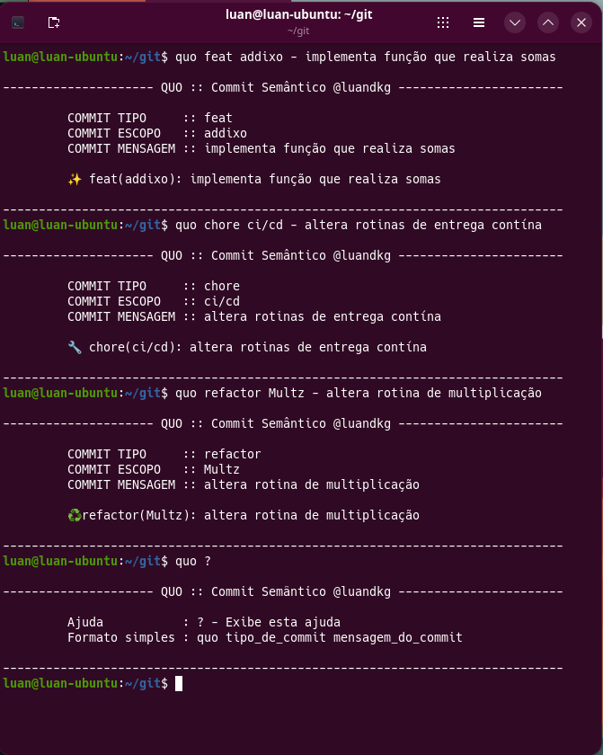

# Quo

O **Quo** é um projeto em D que une **semântica** e **ícones visuais** para padronizar mensagens de commit.  
O objetivo é tornar o histórico de commits mais expressivo, legível e fácil de compreender, comunicando rapidamente o tipo e a intenção de cada alteração.

---

## 🎯 Objetivos

- Definir uma estrutura semântica clara para commits.
- Associar ícones representativos a diferentes tipos de alteração.
- Facilitar a leitura e manutenção de projetos através de um histórico mais organizado.
- Servir como base para ferramentas que validem ou sugiram mensagens de commit consistentes.

---



## 📖 Exemplos de uso

O programa é chamado pela linha de comando como:

```bash
./quo tipo escopo == mensagem
```

O `main` interpreta os argumentos e gera a mensagem semântica com ícone.

### Exemplo 1 — Novo recurso

```bash
./quo feat auth == adicionar login com OAuth
```

**Saída:**

```
✨ feat(auth): adicionar login com OAuth
```

---

### Exemplo 2 — Correção de bug

```bash
./quo fix api == corrigir erro de serialização
```

**Saída:**

```
💥 fix(api): corrigir erro de serialização
```

---

### Exemplo 3 — Documentação

```bash
./quo docs readme == atualizar instruções de uso
```

**Saída:**

```
📚 docs(readme): atualizar instruções de uso
```

---

### Exemplo 4 — Commit inicial

```bash
./quo init == estrutura inicial do projeto
```

**Saída:**

```
🎉 init: estrutura inicial do projeto
```

---

### Exemplo 5 — Commit long com texto numerado

```bash
quo feat@numerado commit_longo - adiciona mecanismo de parser e construção de mensagem longa == Parser de várias mensagens == Construção de frase de commit longa
```

**Saída:**

```
--------------------- QUO :: Commit Semântico @luandkg -----------------------

	 COMMIT TIPO     :: feat
	 COMMIT ESCOPO   :: commit_longo
	 COMMIT MENSAGEM :: adiciona mecanismo de parser e construção de mensagem longa

	 ✨ feat(commit_longo): adiciona mecanismo de parser e construção de mensagem longa

1) Parser de várias mensagens
2) Construção de frase de commit longa
```

Esse formato ajuda a manter o histórico de commits organizado e fácil de entender, especialmente quando há várias partes envolvidas em uma mesma alteração.

---

### Exemplo 6 — Ajuda

```bash
./quo ?
```

**Saída:**

```
     Ajuda           : ? - Exibe esta ajuda
     Formato simples : quo tipo_de_commit mensagem_do_commit
```

---

## Instalação do Quo a partir do GitHub (Linux)

1. **Clone o repositório oficial:**

   ```bash
   git clone https://github.com/luandkg/quo.git
   cd quo
   ```

2. **Compile o Quo usando `dub`:**

   ```bash
   dub build
   ```

   > Isso irá gerar o binário dentro da pasta `./build` (ou conforme a configuração do projeto).

3. **Adicione o caminho do binário ao seu `.bashrc`:**
   Abra o arquivo `.bashrc`:

   ```bash
   nano ~/.bashrc
   ```

   E adicione a seguinte linha ao final (ajuste o caminho conforme o local do build):

   ```bash
   export PATH="$HOME/quo/build:$PATH"
   ```

4. **Recarregue o `.bashrc`:**

   ```bash
   source ~/.bashrc
   ```

5. **Teste a instalação:**
   ```bash
   quo ?
   ```

## 🔮 Futuro

O Quo pretende evoluir para:

- Suporte a diferentes estilos de ícones.
- Integração com pipelines de CI/CD para validação automática.
- Extensões para editores e IDEs que sugiram mensagens de commit padronizadas.
